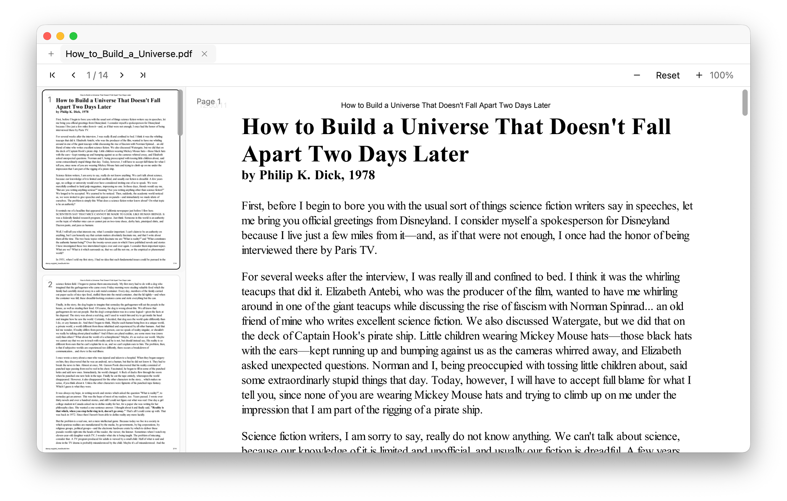
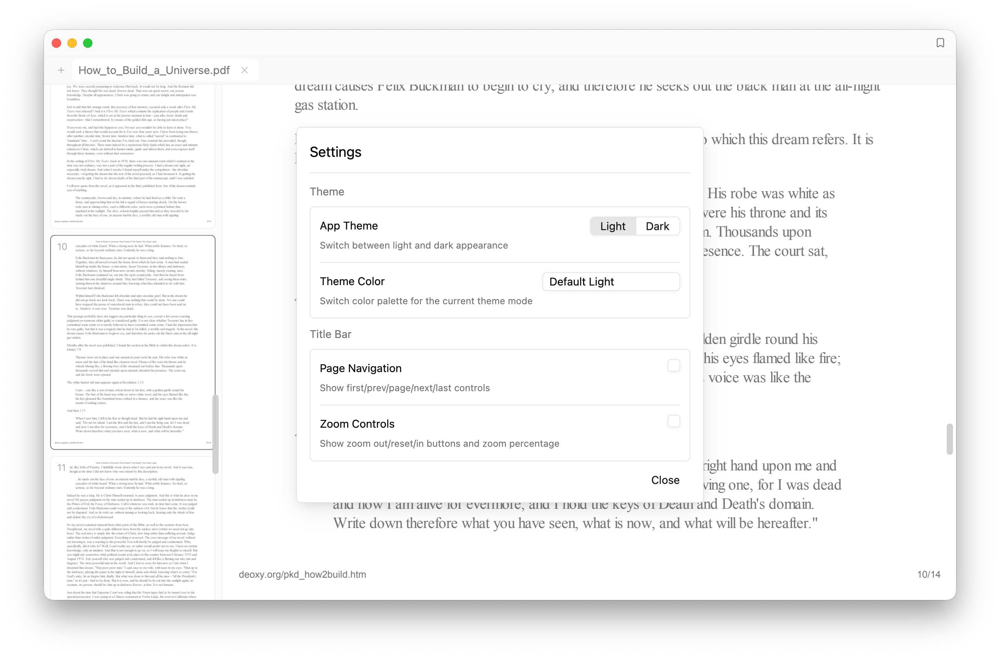
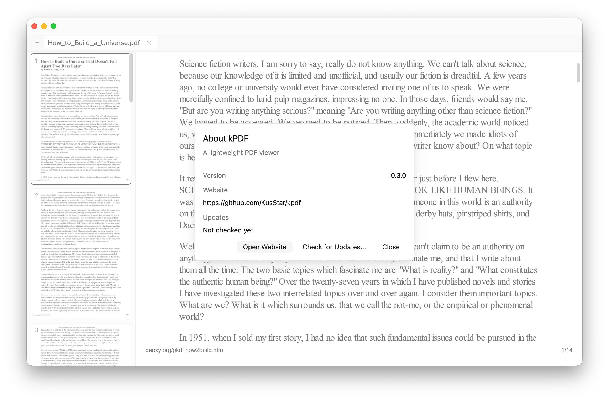

# kPDF

[English](README.md) | [简体中文](README.zh-CN.md)

<p align="center">
  
</p>

<p align="center">
  <a href="https://github.com/KusStar/kpdf/releases">
    
  </a>
</p>

kPDF 是一个基于 Rust + GPUI 的轻量级桌面 PDF 阅读器，专注于流畅阅读、快速切换文件与会话恢复。

## 截图展示





## 功能特性

- 多标签阅读：支持同时打开多个 PDF，标签可拖拽排序
- 缩略图侧栏：左侧页面缩略图导航，右侧正文连续阅读
- 最近文件与会话恢复：
  - 记住最近打开文件（最多 12 个）
  - 记住每个文件上次阅读页
  - 重启后恢复已打开标签和活动标签
  - 记住窗口大小
- 命令面板：快速在“打开文件 / 已打开文件 / 最近文件”间切换和过滤
- 文本选择与复制：支持鼠标框选文本、右键复制和快捷键复制
- Markdown 笔记：在任意页面位置右键可添加/编辑/删除锚点笔记，预览使用 `TextView::markdown`
- 中英文界面：自动根据系统环境选择语言，可通过环境变量覆盖
- 可选文件日志：可在应用菜单中启用/关闭，并打开日志目录

## 技术栈

- Rust (Edition 2024)
- [gpui](https://crates.io/crates/gpui) / [gpui-component](https://crates.io/crates/gpui-component)
- [pdfium-render](https://crates.io/crates/pdfium-render)（PDF 渲染）
- [sled](https://crates.io/crates/sled)（本地状态存储）

## 运行要求

1. 安装 Rust（建议 stable 最新版）
2. 准备 Pdfium 动态库（按平台）：
   - macOS: `libpdfium.dylib`
   - Linux: `libpdfium.so`
   - Windows: `pdfium.dll`

项目会按以下顺序查找 Pdfium：

1. `KPDF_PDFIUM_LIB_DIR` 指定目录
2. App 资源目录及可执行文件附近的 `lib` 目录
3. 当前工作目录及 `./lib`
4. 系统库路径

## 快速开始

```bash
# 开发运行
cargo run

# 发布模式运行
cargo run --release

# 构建发布包
cargo build --release
```

## 快捷键

- `Cmd/Ctrl + O`：打开 PDF
- `Cmd/Ctrl + W`：关闭当前标签
- `Cmd/Ctrl + T`：打开/关闭 Command Panel
- `Cmd/Ctrl + Shift + [`：切换到上一个标签
- `Cmd/Ctrl + Shift + ]`：切换到下一个标签
- `Cmd/Ctrl + 1..9`：切换到对应标签（`9` 跳到最后一个）
- `Cmd/Ctrl + A`：全选当前页文本（已加载文本时）
- `Cmd/Ctrl + C`：复制已选中文本
- `Esc`：
  - 关闭关于弹窗 / 命令面板 / Markdown 笔记编辑器
  - 清除文本选择
- Markdown 笔记编辑器中：
  - `Cmd/Ctrl + Enter`：保存笔记
- 命令面板中：
  - `Up/Down`：移动选择
  - `Enter`：执行当前项

## 环境变量

- `KPDF_PDFIUM_LIB_DIR`：指定 Pdfium 动态库目录
- `KPDF_LOG_FILE`：自定义日志文件路径

## 数据与日志路径

### 本地状态数据库（最近文件、阅读位置、窗口大小、打开标签、书签、Markdown 笔记）

- Windows: `%APPDATA%/kpdf/recent_files_db`
- macOS / Linux: `~/.kpdf/recent_files_db`

### 日志文件默认路径

- Windows: `%APPDATA%/kPDF/logs/debug.log`
- macOS: `~/Library/Logs/kPDF/debug.log`
- Linux: `~/.kpdf/logs/debug.log`

### 日志开关状态文件

- Windows: `%APPDATA%/kpdf/logging_enabled`
- macOS / Linux: `~/.kpdf/logging_enabled`

## 项目结构

```text
.
├── assets/                  # 图标与应用资源
│   └── i18n/                # 国际化 JSON 文案
├── lib/                     # Pdfium 动态库（当前含 macOS 版本）
├── src/
│   ├── main.rs              # 应用入口
│   ├── pdf_viewer.rs        # 核心视图与交互逻辑
│   ├── display_list.rs      # 正文页面渲染列表
│   ├── thumbnail_list.rs    # 缩略图列表
│   ├── command_panel.rs     # Command Panel
│   ├── text_selection.rs    # 文本选择与复制
│   ├── tab.rs               # 标签管理
│   ├── i18n.rs              # 国际化文案
│   └── logger.rs            # 日志开关与落盘
└── Cargo.toml
```
